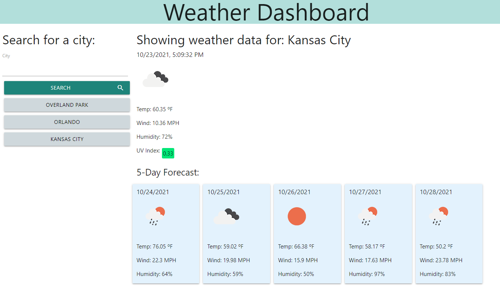

# weather-dashboard

## Purpose

An application in which a user can search by city and view current weather and five day forecast weather data. 

## Technologies
- HTML
- CSS
- JavaScript

With the following APIs:
- OpenWeather
- positionstack
- Materialize CSS

## Website
https://kngurley25.github.io/weather-dashboard/

## Image
